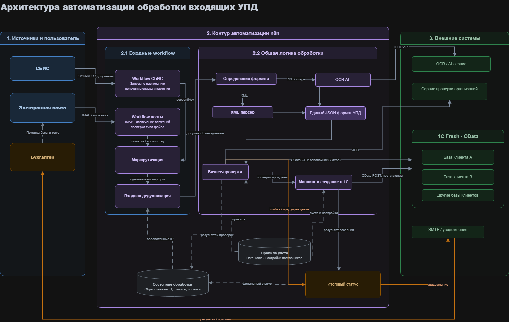
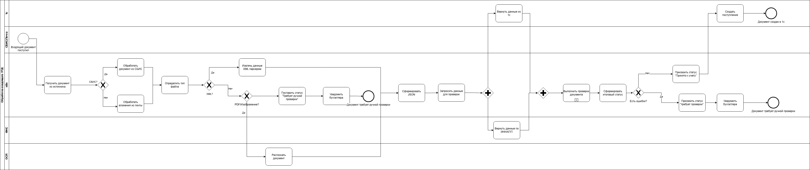

# Проект: Автоматизация документооборота в 1с через n8n. Прием и обработка УПД.

## Описание

Проект представляет собой автоматизацию приема первичных документов с использованием n8n
- Основной пользователь процесса - главный бухгалтер, который контролирует выполнение процесса, решает спорные моменты
- Решение на базе n8n автоматически получает документы из СБИС и почты, извлекает данные XML, PDF, Сканов, проверяет реквизиты, соответствие договору, номенклатуру, схождение сумм НДС, заполнение строк 5a/5б. создает документ «Поступление товаров/услуг» на основании УПД в 1с, подставляет контрагента по ИНН, выбирает договор по номеру/наименованию, заполняет табличную часть, автоматически контролируя тип документа, отражение по счетам, дублирование документов по номенклатуре, по одному и тому же договору/периоду.
- Дополнительно была реализована административная панель для управления правилами поставщиков и счетами учета. 

## Архитектура 

## Основной процесс

Диаграмма показывает процесс обработки входящего УПД: получение документа из СБИС или почты, определение типа файла, извлечение данных, выполнение проверок и создание документа поступления в 1С либо передачу документа на ручную проверку.

## Моя роль в проекте

 - Анализ бизнес-процесса обработки первичных документов
 - Выделение бизнес-правил и контрольных точек
 - Проектирование workflow в n8n
 - Настройка HTTP API-интеграций
 - Работа с OData API 1C
 - Обработка XML и JSON данных
 - Написание и адаптация JS-обработок
 - Проектирование статусов и обработки ошибок
 - Тестирование сценариев обработки.

## Стек технологий 

- n8n;
- HTTP Request;
- OData API 1С;
- API СБИС;
- SMTP Gmail;
- JavaScript;
- JSON;
- XML;
- LLM / OCR-инструменты;
- DaData API;
- n8n Data Tables;
- n8n Webhooks.

## Документация
* [Контекст и описание проекта](docs/01_context.md)
* [Текущий процесс обработки документов — AS-IS](docs/02_as_is_process.md)
* [Целевой процесс обработки документов — TO-BE](docs/03_to_be_process.md)
* [Роли и участники процесса](docs/04_roles.md)
* [Функциональные требования к системе](docs/05_functional_requirements.md)
* [Нефункциональные требования к системе](docs/06_non_functional_requirements.md)
* [Основные бизнес-правила](docs/07_business_rules.md)
* [Описание интеграций](docs/08_integrations.md)
* [Маппинг данных УПД в 1С](docs/09_data_mapping.md)
* [Результаты проекта](docs/13_results.md)
* [Диаграмма классов](diagrams/classDiagram.png)

## Примеры данных

* [Пример входящего документа](examples/sample_input_document.json)
* [Пример данных для создания документа в 1С](examples/sample_output_to_1c.json)
* [Пример ответа с ошибкой обработки](examples/sample_error_response.json)
* [Пример логики валидации на JavaScript](examples/pseudo_js_validation.js)

## Результат 
* [Скриншот логики получения УПД из СБИС ](images/sbis_workflow.png)
* [Скриншот основной логики обаботки ](images/main_workflow.png)
Успешно реализована автоматизация обработки входящих УПД, от получения входящих документов до создания документа поступления в 1с
Автоматизация может сократить до 20% рабочего времени бухгалтера.
