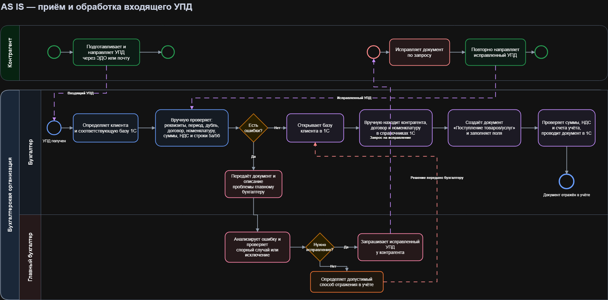

# AS IS процесс

## Назначение документа
Цель - Зафиксировать текущее состояние бизнес-процессов в организации. Отражение того, как работа выполняется на практике, учитывая особенности, недостатки и лишние действия.

## Участники процесса
- Контрагенты - внешние организации и ИП, которые направляют УПД в организацию.
- Бухгалтер - сотрудник, который принимает документы, проверяет его корректность и заносит в базу 1С.
- Главный бухгалтер - контролирует корректность обработки документов, принимает решения по спорным или ошибочным документам, согласовывает исправления.
- Клиент бухгалтерской организиции - компания, для которой ведется бухгалтерский учет и принимаются первичные документы.
- Системы ЭДО - СБИС или Диадок, через которые контрагенты могут направлять УПД.
- 1С - учетная система, в которую бухгалтер вручную вносит данные из полученного УПД. Ввод выполняется в базу 1С того клиента, к которому относиться документ.

## Описание текущего процесса
Процесс начинается с отправления УПД контрагентом в адрес организации. Документ может поступить через СБИС, Диадок или электронную почту бухгалтера.

Бухгалтер отслеживает поступление документов в разных каналах. После получения УПД бухгалетр выполянет проверку документа: сверяет основные реквизиты УПД: номер и дату документа, наименование контрагента, ИНН, КПП, сумму, НДС. наименование товаров, работ, услуг, а также корректность заполнения документа в целом. 

Если документ заполнен корректно, бухгалтер вручную вводит данные из УПД в учетную систему клиента (1С), и документ считается обработанным.

Если при проверки документа найдены ошибки, бухгалтер передает проблему гл. бухгалтеру. Он анализирует ситуацию и принимает решение.

После решения проблемы бухгалтер продолжает обработку документа и вносит его в учетную систему клиента (1С) или ожидает исправленную версию от контрагента.

## AS-IS Диаграмма

## Проблемы текущего процесса
* Основная проблема - ручная обработка документов, которая занимает у бухгалтера много времени и увеличивает вероятность ошибок. При большом количестве документов бухгалтер тратит значительное время на однотипные операции, связанные с переносом данных из документа в учетную систему.
* Поступление документов через разные каналы (СБИС, Диадок, почта ) из-за этого бухгалтеру приходиться вручную контролировать источники поступления, что повышает риск пропуска документа.
* Отсутсвие единого автоматического контроля статусов документов. Нет удобной возможности определить, какие УПД получены, какие внесены в 1С, какие находятся на рассмотрении у гл. бухгалтера.
* Зависимость от бухгалетра. Если он пропустит письмо или уведомление в ЭДО, документ может быть обработан с задержкой или быть утерян.

## Риски
- Риск пропуска документов

- Риск задержки обработки

- Ошибки ручного ввода

- Риск дублирования документа

Таким образом, текущий процесс является трудоемким и неудобным для бухгалетрской организации, требует оптимизации.