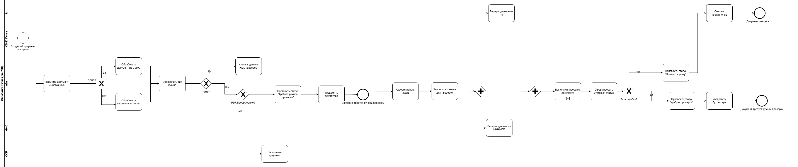

# TO BE процесс

## Назначение документа
Цель - показать как должен работать процесс после автоматизации.

## Участники процесса
- Контрагенты - внешние организации и ИП, которые направляют УПД в организацию.
- Главный бухгалтер - контролирует корректность обработки документов, принимает решения по спорным или ошибочным документам, согласовывает исправления.
- Клиент бухгалтерской организиции - компания, для которой ведется бухгалтерский учет и принимаются первичные документы.
- СБИС - система ЭДО, из которой документы автоматически получаются через API.
- Диадок - система ЭДО, документы из которой не подключаются напрямую по API, а направляются на электронную почту для последующей обработки.
- Электронная почта - дополнительный канал получения документов от контрагентов, включая перенаправленные из Диадок.
- n8n - система автоматизации, которая получает документы, определяет тип файла, извлекает данные, выполняет проверки, формирует статус обработки, и передает данные в 1с.
- OCR - внешний сервис, который используется для извлечения данных из PDF и изображений.
- DaData - внешний источник данных для проверки корректности ИНН и КПП контрагента.
- 1С fresh - учетная система, в которой хранятся данные клиентов, контрагентов, договоров, номенклатуры и создаются документы поступления.

## Описание целевого процесса
Процесс начинается с отправления УПД контрагентом в адрес организации. 
Документ может поступить одним из следующих способов:
 - Через СБИС;
 - Через электронную почту;
 - Через Диадок с последующим направлением документа на электронную почту.
В рамках проекта прямая API интеграция с Диадок не реализуется, так как подключение API для каждого контрагента является дорогостоящим и нецелесообразным. Поэтому было принято решение направлять документы из Диадок на электронную почту и обрабатывать как почтовые вложения.

Если документ поступает из СБИС, n8n получает его через API СБИС. Если документ поступает через электронную почту, n8n получает письмо через IMAP, извлекает вложения и передает их на дальнейшую обработку.

После поступления документа n8n автоматически получает его из доступного источника. Если документ поступил из СБИС, система проверяет не был ли документ уже обработан по уникальному ID. Если документ обрабатывался, повтораня обработка не выполняется.

Далее n8n определяет тип входящего файла: XML, PDF, изображение, неизвестный формат. 

Если документ в формате XML, данные извлекаются с помощью XML-парсера. Если документ в формате PDF или изображения, файл отправляется на OCR обработку для извлечения реквизитов и табличной части. Если формат неизвестен, документ получает статус требует ручной проверки, а гл. бухглатер получает уведомление.

После извлечения данных система приводит документ к единому JSON-формату. Этот формат включает данные: УПД, номер и дата документа, данные поставщика и покупателя, ИНН, КПП, договор, суммы НДС, строки 5а и 5б, табличная часть, источник документа, тип файла, статус.

После приведения в единый формат выполняются автоматические проверки документа. Для этого система обращается к внешним сервисам.
DaData - для проверки ИНН и КПП контрагента в реестре ФНС.
1С Fresh - для поиска контрагента, организации, договора, дублей документов и номенклатуры в базе 1с клиента.

Логика проверок выполняется на стороне системы. 1C Fresh используется как источник данных.
Основные автоматизированные проверки:
* заполнение обязательных реквизитов;
* корректность ИНН и КПП;
* наличие контрагента в 1С;
* наличие организации клиента в 1С;
* наличие договора;
* наличие дублей документа;
* корректность сумм и НДС;
* заполнение строк 5а и 5б;
* соответствие номенклатуры;
* наличие правил счетов учета поставщика

Если документ прошел проверки, n8n формирует данные для создания документа "поступления товаров/услуг" в 1C Fresh. После успешного создания документа в 1C документ получает статус "принят к учету"
Если в документе обнаружены ошибки, документ получает статус "Требует ручной проверки" и формируется уведомление гл.бухгалтеру. Уведомление содержит реквизиты документа и список причин, по которым документ не обработан.

Если внешняя система недоступна или произошла критическая ошибка, документ не теряется. Система фиксирует ошибку и присваивает статус "Требует ручной проверки" и уведоляет бухглатера о проблемах. 
## TO BE Диаграмма

## Результаты целевого процесса

В результате внедрения системы организация получает:

- Автоматический прием документов из разных источников.
- Снижение количества ручных действий бухгалтера.
- Единый порядок обработки УПД.
- Автоматические проверки документа и его создание в 1С.
- Удобный контроль статусов документа.
- Снижение риска пропуска, дублирования и ошибочного ввода.
- Увеличение скорости обработки входящих документов.
- Уменьшает риск пропуска документов из разных источников

## Связанные документы

[Контекст проекта](01_context.md)
- [AS IS процесс](02_as_is_process.md)
- [Роли и участники](04_roles.md)
- [Функциональные требования](05_functional_requirements.md)
- [Нефункциональные требования](06_non_functional_requirements.md)
- [Бизнес-правила](07_business_rules.md)
- [Интеграции](08_integrations.md)
- [Маппинг данных](09_data_mapping.md)
- [Модель статусов](10_status_model.md)
- [Обработка ошибок](11_error_handling.md)
- [Тест-кейсы](12_test_cases.md)
- [Результаты проекта](13_results.md)